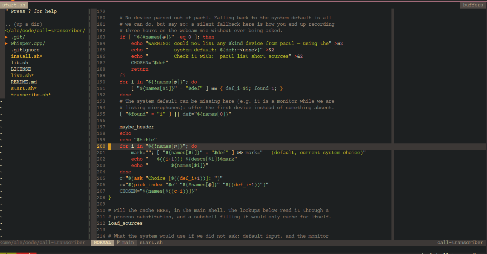

# My Vim Setup

This is my personal Vim configuration. Follow the steps below from top to
bottom and you'll end up with the exact same editor I use — autocompletion,
file search, Git integration, and more.

No prior Vim knowledge is required to install it. Just copy and paste the
commands for your operating system.



> **Supported platforms:** Ubuntu 26.04 LTS and macOS. Those are the two the
> config is installed and tested on; `install.sh` refuses to run anywhere else
> rather than half-installing a toolchain. Both ship a Vim new enough for the
> autocompletion engine (**9.0.0438 or newer** — see the table in step 1). On
> anything older the editor and every keymap still work, but coc.nvim declines
> to start, so completion, diagnostics and go-to-definition are all absent.

---

## 0. On its own, or as part of best-linux-environment

Both work, and this repo is written not to care which one ran it. **If you just
want Vim, skip to step 1 — that is the standalone path and it is complete.**

**On its own** — clone it into `~/.vim` (step 1 has the command), run
[`install.sh`](./install.sh), done. That script
owns every vim-specific step (system deps, `~/.vimrc`, the plugins, the language
servers); nothing outside this repo is needed. This is also the only way to get
this config on **macOS**.

**As part of a whole machine** —
[**best-linux-environment**](https://github.com/Spuppateddu/best-linux-environment)
sets up an entire Ubuntu box, and this is one of the config repos it manages.
Its `./setup.sh` clones this one into `~/linux-configuration/vim`, leaves
`~/.vim` behind as a symlink to it, and then calls this repo's own `install.sh`
— the same script, doing the same work. The one difference you will notice is
step 4: it asks which languages you want as part of its own single round of
questions and passes the answer down as `--languages=…`, so this script does not
stop to ask again. It also keeps the repo pulled and re-applied at every boot.

---

## 1. Install the required programs

**The short version: run `./install.sh` and skip to step 5.** It installs
everything below for your platform, asks which programming languages you want
support for (see step 4), points `~/.vimrc` at this repo and installs the
plugins. It's idempotent, so re-running it is always safe, and `--dry-run` shows
what it would do without touching anything.

The rest of this section is the by-hand equivalent, for when you'd rather see
each step. `install.sh` is the source of truth for the package lists — if these
ever disagree with it, believe the script.

### Ubuntu 26.04 LTS

```bash
sudo apt update
sudo apt install vim git nodejs npm ripgrep silversearcher-ag
sudo npm install -g --ignore-scripts yarn
```

### macOS

If you don't have Homebrew yet, install it first from https://brew.sh, then run:

```bash
brew install vim git node yarn ripgrep the_silver_searcher
```

### Only if you write C

C is the one language here that needs a system package — `clangd`, its language
server. The servers for PHP, JavaScript and Python are Vim extensions that
install themselves (step 3). `install.sh` fetches this one only if you answer
yes to C.

```bash
sudo apt install clangd          # Ubuntu
brew install llvm                # macOS — then read the note just below
```

Homebrew's `llvm` is *keg-only* — it is not linked into your PATH, because macOS
already ships its own `clang`. So `clangd` is installed but unfindable until you
add it. Paste this once, then open a new terminal:

```bash
LINE="export PATH=\"\$PATH:$(brew --prefix llvm)/bin\""
grep -qxF "$LINE" ~/.zshrc || echo "$LINE" >> ~/.zshrc
```

The `grep` is there so pasting this twice doesn't leave two copies of the export
in your profile — this section is worth re-reading, and a plain `>>` appends
every time. `install.sh` does the same check for you.

Note the `$PATH:` comes **first**. That formula also contains `clang`, `clang++`
and `ld`, and putting its folder ahead of the system one would make them your
default compiler everywhere — which is exactly what keg-only exists to avoid.
macOS has no `clangd` of its own, so the end of the PATH is enough to find it.

(If you use bash rather than zsh, write to `~/.bash_profile` instead.
`install.sh` picks the right file for you.)

**What each program is for:**

| Program | Why it's needed |
|---|---|
| `vim` | The editor itself — **9.0.0438 or newer**, which is the minimum coc.nvim will start on. Below it you get a working editor with no completion, and one startup message that scrolls away. Check with `vim --version \| head -1` |
| `git` | Downloads this config and powers the in-editor Git features |
| `node` / `npm` | Required by the autocompletion engine (coc.nvim) |
| `yarn` | Used to build a few plugins |
| `ripgrep` | Fast file content search (used by FZF) |
| `the_silver_searcher` (`ag`) | Project-wide text search |
| `clangd` | C/C++ autocompletion and diagnostics — **only if you write C** (`llvm` on macOS) |

---

## 2. Install the configuration

Copy this whole config into a folder called `.vim` in your home directory, then
tell Vim to use it.

```bash
# 1. Download the config into ~/.vim
git clone <THIS_REPO_URL> ~/.vim

# 2. Point Vim at it (this replaces your current ~/.vimrc)
echo "runtime vimrc" > ~/.vimrc
```

> Replace `<THIS_REPO_URL>` with the address of this repository.
> ⚠️ The second command overwrites `~/.vimrc`. If you already have one you want
> to keep, back it up first with `cp ~/.vimrc ~/.vimrc.backup`.

---

## 3. Install the plugins

Open Vim:

```bash
vim
```

The plugin manager (vim-plug) is already bundled, so just run this **inside
Vim** and press Enter:

```vim
:PlugInstall
```

Wait for it to finish, then **quit and reopen Vim**. On the next launch the
autocompletion extensions for the languages you chose (see the next step)
install themselves automatically. Give it a minute the first time.

To quit Vim at any point, type `:q` and press Enter.

### Updating the plugin manager itself

vim-plug is *bundled* — it's checked into this repo at `autoload/plug.vim`
rather than downloaded during install, which is what makes `git clone` plus
`:PlugInstall` enough on a machine with nothing set up yet. The trade is that
it's a copy of someone else's code sitting in the repo, and nothing refreshes it
on its own: `install.sh` installs and updates *plugins*, never the manager.

So bump it by hand now and then, inside Vim:

```vim
:PlugUpgrade
```

That rewrites `autoload/plug.vim` in place, so it turns up as a modified file in
`git status` — read the diff and commit it like any other change. There's no
need to chase every release; it's a "once in a while" job, not part of install.

---

## 4. Choosing your languages

This config supports four languages, and installs only the ones you ask for.
Each carries a *language server* — the program behind autocompletion, go-to-
definition and error underlining — and those are hundreds of megabytes and a
background process per open file, so there's no sense installing PHP's on a
machine you only write Python on.

`install.sh` asks about each one, and the answer is remembered. A fresh clone
starts from *all four* (see "Changing your mind later" below for why), so on a
first run every question is `[Y/n]` — Enter keeps the language, and only an
explicit `n` declines it:

```
══ Language support ══
  PHP — Laravel, Blade templates [Y/n]
  JavaScript / TypeScript — React, Next.js, Tailwind [Y/n] n
    - will be removed
  Python [Y/n]
  C [Y/n] n
    - will be removed
```

| Answer yes to | And you get |
|---|---|
| **PHP** | Intelephense (PHP), Blade template syntax and completion — so Laravel projects work |
| **JavaScript** | tsserver (JS + TypeScript), ESLint, Prettier, JSX/React syntax, Tailwind — so React and Next.js projects work |
| **Python** | Pyright |
| **C** | clangd. The build keys in step 6 (`<Space>b` / `<Space>x`) work either way — they only need `gcc`/`make`, so answering no here costs you completion and diagnostics, not compiling |

Prettier, CSS and Tailwind come with **either** PHP or JavaScript: a Blade view
is as much CSS and Tailwind as a Next page is.

Everything that isn't a language — file search, Git, the file tree, spell-check,
Markdown, JSON, SQL, all the keymaps — is always installed.

### Changing your mind later

Started a Laravel job? Finished the C course and want the disk back? Run the
installer again:

```bash
cd ~/.vim && ./install.sh
```

It asks about all four, offering to keep the ones you already have:

- A language you have is asked as `[Y/n]` — **Enter keeps it**. Only an explicit
  `n` drops it, so a tired Enter can never delete anything.
- A language you don't have is asked as `[y/N]`, and `y` installs it.

Or skip the questions entirely. Here the list is the *whole* set you want, so
anything left out of it is removed:

```bash
./install.sh --languages=php,javascript    # exactly these two
./install.sh --languages=all
./install.sh --languages=none              # core plugins only
```

**What dropping a language actually deletes:**

| Deleted | Kept |
|---|---|
| Its syntax plugins, deleted from `plugged/` by name | Plugins and extensions you installed yourself — the list of what to delete is a diff of what *this config* declares, so nothing else is ever in it |
| Its language server, from `~/.config/coc/extensions` (directory **and** the `package.json` entry, or coc would reinstall it on the next launch) | System packages. `clangd` is a general C toolchain component that other tools use and apt may have pulled in for something else, so dropping C leaves it — the installer prints the `apt remove` line and lets you decide |

Nothing else is touched, and re-adding a language later just reinstalls it.

If `config_files/languages.vim` doesn't exist at all — a fresh `git clone` where
nobody ran the installer — Vim assumes all four, which is what this config did
before the list existed. The installer reads a missing file the same way, so the
first run offers to keep all four and genuinely removes the ones you decline.

With no terminal to ask on — CI, or an orchestrator that clones this repo and
calls `./install.sh` itself — the installer keeps whatever the file already
says, and installs all four only when there is no file to read. So a deliberate
`--languages=c` survives every later unattended run rather than being quietly
undone by one.

Cleanup compares what's on disk against what you chose, rather than trusting the
previous run to have recorded things correctly. So a re-run also clears anything
an earlier install left behind, and editing the list by hand then re-running is
enough to make the tidy-up happen.

---

## 5. Optional setup

These steps are only needed if you use the matching feature.

### PHP autocompletion (Intelephense premium)

The free version works out of the box. If you have a premium license key, keep
it out of Git by storing it in an **untracked** file at
`~/.vim/config_files/secrets.vim` (this path is already gitignored).

Create the file with this single line, replacing the key with your own:

```vim
autocmd User CocNvimInit call coc#config('intelephense.licenseKey', 'YOUR_KEY_HERE')
```

`vimrc` loads this file automatically on startup if it exists, so the licence
activates the next time you open Vim. Because it's gitignored, your key never
gets committed or pushed.

Activation guide: https://github.com/yaegassy/coc-intelephense

### C / C++ autocompletion

Syntax highlighting works with no setup. For autocompletion, function signatures
(`printf(` shows its arguments), hover docs and go-to-definition, `clangd` must
be on your PATH. `install.sh` installs it when you answer yes to C (step 4), so
this is for when you said no then changed your mind — either re-run the
installer, or:

```bash
sudo apt install clangd          # Linux
brew install llvm                # macOS — then add it to PATH, see step 1
```

Check it worked with `clangd --version` in a terminal.

`coc-clangd` is only a thin client around that binary. Without it, C completion,
diagnostics and `<Space>h` are silently inert. Compiling stays in the terminal —
nothing here builds your code, `clangd` only reads it.

On a multi-file project, let `clangd` learn your real include paths by recording
a build once (`sudo apt install bear` first):

```bash
bear -- make
```

That writes a `compile_commands.json` next to your Makefile. Without it, single
files still work using the `-std=c17` fallback set in `coc-settings.json`.

Handy in C files: `<Space>h` switches between `foo.c` and `foo.h`, `K` shows docs
or falls back to the man page, and `gf` on an `#include` opens the header.

#### Building and running

| Key | Does |
| --- | --- |
| `<Space>b` | Compile. Errors go to the quickfix list. |
| `<Space>x` | Compile, then run the program in a terminal split. |
| `]q` / `[q` | Jump to the next / previous error. |
| `<Space>qc` | Close the quickfix window. |

The file is saved before each build. If a `Makefile` exists anywhere above the
current file, `make` is used; otherwise the file is compiled on its own with
`gcc -Wall -Wextra -g`. Warnings don't stop the program from running.

Because errors land in the quickfix list, `]q` moves the cursor **directly to
the offending line** — no reading line numbers and jumping by hand. The terminal
split is a real terminal, so `scanf()` and other input works normally.

### Spell-check dictionary

Spell-checking runs on prose filetypes only — Markdown, plain text, commit
messages, HTML and Blade views. The list is `cSpell.enabledLanguageIds` in
`coc-settings.json`; it replaces the extension's default, which covers most
source languages.

Custom words for the spell-checker live in `~/.vim/cspell-words.txt` (one word
per line). This file is **not** tracked by Git because it can contain private
project or client names.

The path in `coc-settings.json` is absolute on purpose. cSpell resolves a
relative path *against the project you have open*, so `./cspell-words.txt` meant
every project looked for its own list and the one in `~/.vim` was never read or
written — words you added seemed to vanish.

That absolute path can only name `~/.vim`, while the rest of the config derives
its paths from wherever the repo actually is, so a worktree or test checkout had
Vim creating one file and cSpell reading another. `config_files/coc.vim`
overrides the setting on startup with the path for the checkout in use; the
entry in the JSON is the fallback for a normal `~/.vim` install.

You don't need to create it manually — Vim creates an empty one on startup if
it's missing, so a fresh clone works without any warnings. Whenever you choose
"Add word to dictionary" inside Vim, the word is appended to this file
automatically.

---

## 6. Keys

`<leader>` is the **Space** bar.

### Getting around

| Key | Does |
| --- | --- |
| `<Space>fi` | Find file by name |
| `<Space>fo` | Search text across the project |
| `<Space>fp` | The same search, but reaching into gitignored files too |
| `:Files src/` | Limit the file search to a folder |
| `:Ag foo` / `:AgAll foo` | The same two searches with the term given up front. Called bare, either lists every line in the project for fzf to filter |
| `Ctrl-t` / `Ctrl-y` | Toggle the file tree / reveal the current file in it |
| `<Space>n` / `<Space>N` | Same two, for when a multiplexer eats `Ctrl-t`/`Ctrl-y` |
| `[b` / `]b` | Previous / next buffer |
| `<Space>D` | Close the current buffer |
| `<Space>vp` / `<Space>vo` | Split vertically / horizontally |

> **`<Space>fo` vs `<Space>fp`.** Both search the text of the whole project and
> both skip `.git` and `node_modules`. The difference is `.gitignore`: `<Space>fo`
> honours it, so you're searching tracked source, and `<Space>fp` ignores it, for
> the times what you're after is in build output, a vendored dependency or a
> `.env`.
>
> Either way you get every line in the project and then type to narrow it down.
> What you type is matched **literally**, as a plain substring — fzf's default is
> to scatter your letters across the line, which for code means `rebus-polito`
> also matches `rebus-politico-finanziario` and a few hundred lines besides. Case
> is still ignored unless you type a capital, and prefixing one word with `'`
> opts that word back into loose matching.

### Code

| Key | Does |
| --- | --- |
| `gd` `gy` `gi` `gr` | Go to definition / type / implementation / references |
| `K` | Show docs (falls back to the man page in C) |
| `[g` / `]g` | Previous / next diagnostic |
| `<Space>qf` | Apply the quick fix on this line |
| `<Space>ac` / `<Space>as` | Code actions at the cursor / for the whole file |
| `<Space>al` | Run the code lens on this line |
| `<Space>re` | Refactor |
| `<Space>a` / `<Space>r` (visual) | Code action / refactor on the selection |
| `<Space>tu` | Format the file |
| `<Space>s` | Grow the selection to the next enclosing block |
| `<Space>cc` / `<Space>c<Space>` | Comment / toggle comment (nerdcommenter) |
| `<Space>h` | In C/C++: switch between `foo.c` and `foo.h` |
| `jj` | Escape from insert mode |

### Editing and the screen

| Key | Does |
| --- | --- |
| `<Space>w` | Clear the search highlight |
| `<Space>tn` | Toggle line numbers on / off |
| `<Space>K` | Insert an empty `- [ ]` checkbox, for notes |

### Lists (`<Space>l`)

| Key | Does |
| --- | --- |
| `<Space>ld` | All diagnostics in the project |
| `<Space>lo` | Outline of the current file |
| `<Space>ls` | Search symbols across the workspace |
| `<Space>lc` / `<Space>le` | Commands / installed extensions |
| `<Space>lj` / `<Space>lk` | Next / previous item |
| `<Space>lp` | Reopen the last list |

> **Why the keys are laid out this way.** A binding that is *both* a complete
> mapping and the prefix of a longer one — say `<Space>a` alongside `<Space>ac`
> — makes Vim pause for `timeoutlen` on every press, waiting to see if the
> longer one is coming. coc's README puts its lists on bare `<Space>a` and
> `<Space>c`, which is why they were moved: `<Space>c` sat in front of every
> nerdcommenter mapping, so commenting only worked if you typed the second key
> fast enough.
>
> So `<Space>` bindings here are leaves *or* prefixes, with one deliberate
> exception: `<Space>y` (see below). It's an operator, so it waits for a motion
> either way and the next keystroke settles it.
>
> `jj` is the same trade in insert mode — it makes `j` a prefix, so a `j` you
> stop typing after waits `timeoutlen` before it appears. Mid-word the next
> keystroke resolves it instantly, so in practice the pause only shows up when a
> word ends in `j` and you pause right there.
>
> The same trap applies across a buffer-local and a global mapping — buffer-local
> priority does **not** exempt it. `<Space>h` in C files is buffer-local while
> gitgutter's `<Space>h{p,s,u}` are global, so that one is declared `<nowait>`.

### Yank to the system clipboard

On Ubuntu, Vim is built without `+clipboard`, so the `"+` register does not
exist there at all. Copying goes through OSC 52 instead, which asks the
*terminal* to set the clipboard — that works over SSH and inside tmux, where
`"+` never could. Homebrew's Vim on macOS does have `+clipboard`, but the same
keys are used on both so there's only one thing to remember.

Check which you have with `vim --version | grep clipboard`.

| Key | Does |
| --- | --- |
| `<Space>y` + motion | Copy that motion (e.g. `<Space>yip` for a paragraph) |
| `<Space>yy` | Copy the current line |
| `<Space>y` (in visual mode) | Copy the selection |

> Plain `y`, `yy` and `p` still work as normal — they use Vim's own registers
> and stay inside the editor.

> **Registers and history are not saved between sessions.** Vim's default
> `viminfo` writes up to 50 lines of every register into `~/.viminfo`, so yanking
> a block out of a `.env` left a plaintext copy on disk that outlives the file —
> the same reason undo files are switched off for those (see below). It saves
> your `:` and `/` histories too, so rotating a key with
> `:%s/OLD_TOKEN/NEW_TOKEN/g` wrote both values there verbatim, and even
> searching for a secret to find its line left the pattern behind. `viminfo` has
> no per-file exemption, so all three are dropped from it entirely. Within a
> session registers, command history and search history all behave normally;
> after quitting, they're gone.

### Keys that are deliberately *not* mapped

`<C-v>` (blockwise visual), `<C-m>` (which the terminal sends for Enter) and
`<C-g>` (file info) are left alone — each is something Vim needs with no
substitute. Buffer switching lives on `[b` / `]b` / `<Space>D` instead.

`<C-t>` and `<C-y>` *are* mapped, to the file tree. That costs the tag-stack pop
and scroll-up-one-line builtins, which is a deliberate trade: go-to-definition
goes through coc's `gd` rather than the tag stack, and `<C-o>` is the usual way
back.

The rest of the Ctrl keys in use are claimed by plugins rather than by this
config, so they're easy to forget about:

| Key | Taken by | Builtin it costs |
| --- | --- | --- |
| `<C-e>` | winresizer (start resize mode) | Scroll down one line |
| `<C-h>` `<C-j>` `<C-k>` `<C-l>` | vim-tmux-navigator (move between splits) | `<C-l>` redraw; the others were already near-unusable in a terminal |
| `<C-\>` | vim-tmux-navigator (previous split) | — |
| `<C-n>` | vim-visual-multi (multiple cursors — see below) | Move down one line, same as `j` |
| `<C-Up>` / `<C-Down>` | vim-visual-multi (add a cursor above / below) | — |

It also takes two Shift keys in normal mode, `<S-Right>` and `<S-Left>`, which
cost the builtin "word forward / word back" those send (the same as `w` and `b`).

### Multiple cursors

vim-visual-multi is installed but never mentioned above, because its keys are
its own rather than anything this config sets.

| Key | Does |
| --- | --- |
| `<C-n>` | Select the word under the cursor; press again to add the next occurrence. Then type as normal and every cursor edits at once |
| `<C-n>` (in visual mode) | The same, but on the selection rather than the word under the cursor |
| `<C-Up>` / `<C-Down>` | Add a cursor straight up / down a column, instead of by match |
| `<Esc>` | Back to a single cursor |

Its remaining commands sit behind its own leader, which is **two backslashes**
(`\\`, not the `\` you might expect):

| Key | Does |
| --- | --- |
| `\\A` | Select every occurrence in the file at once |
| `\\/` | Start a regex search and put a cursor on each match |
| `\\\` | Add a cursor at the current position |
| `\\gS` | Reselect the previous set of cursors |

That leader is separate from this config's `<Space>`, so nothing here collides
with it.

`<C-s>` is deliberately **not** used, though coc's README suggests it for
`coc-range-select`. On a terminal that still has software flow control enabled —
the default unless you've run `stty -ixon` — `<C-s>` is XOFF and never reaches
Vim at all: it freezes terminal output until `<C-q>`, which looks exactly like
Vim hanging. That mapping lives on `<Space>s` instead.

---

## 7. Installing extra autocompletion extensions

You normally don't need to — the defaults install on their own. But if you want
more, browse the marketplace inside Vim:

```vim
:CocList marketplace
```

Or install one directly, for example Tailwind:

```vim
:CocInstall @yaegassy/coc-tailwindcss3
```

Marketplace reference: https://github.com/fannheyward/coc-marketplace
